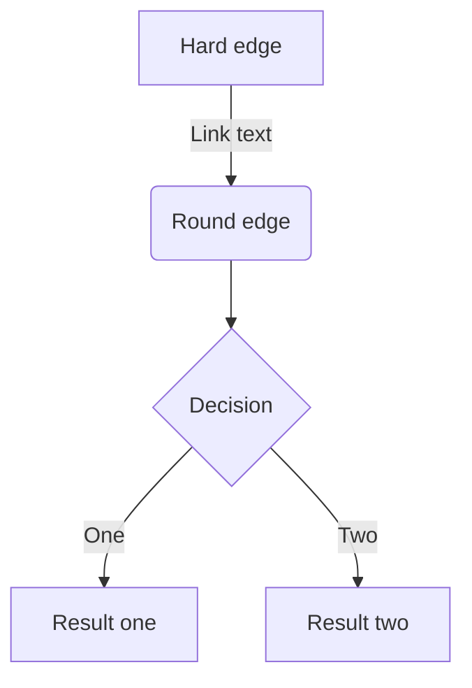
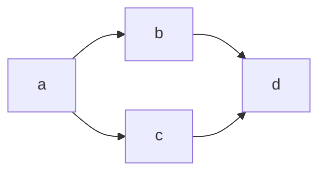

## 見出し1

### 見出し2

#### 見出し3

- Hello!
- Hola!
  - Bonjour!
  - Hi!

1. First
2. Second

[アンカーテキスト](リンクのURL)


*サターンVロケットの一段目エンジン*

| Head | Head | Head |
| ---- | ---- | ---- |
| Text | Text | Text |
| Text | Text | Text |

```cpp:main.cpp
#include<iostream>
using namespace std;

int main(){
    cout << "Hello World!" << endl;
    return 0;
}
```

:::details 出力
Hello World!
:::

```diff cpp:diff.cpp
#include<iostream>
using namespace std;

int main(){
+   cout << "Hello World!!!" << endl;
-   cout << "Hello World!" << endl;
    return 0;
}
```

$$
e^{i\theta} = \cos\theta + i\sin\theta
$$

> 引用文
> 引用文

脚注の例[^1]です。インライン^[脚注の内容その2]で書くこともできます。

[^1]: 「Linuxとpthreadsによるマルチスレッドプログラミング入門」, 渋谷克智

-----

*イタリック*
**太字**
~~打ち消し線~~
インラインで`code`を挿入する

:::message
メッセージをここに
:::

:::message alert
警告メッセージをここに
:::

:::details タイトル
表示したい内容
:::

::::details タイトル
:::message
ネストされた要素
:::
::::


https://zenn.dev/zenn/articles/markdown-guide




