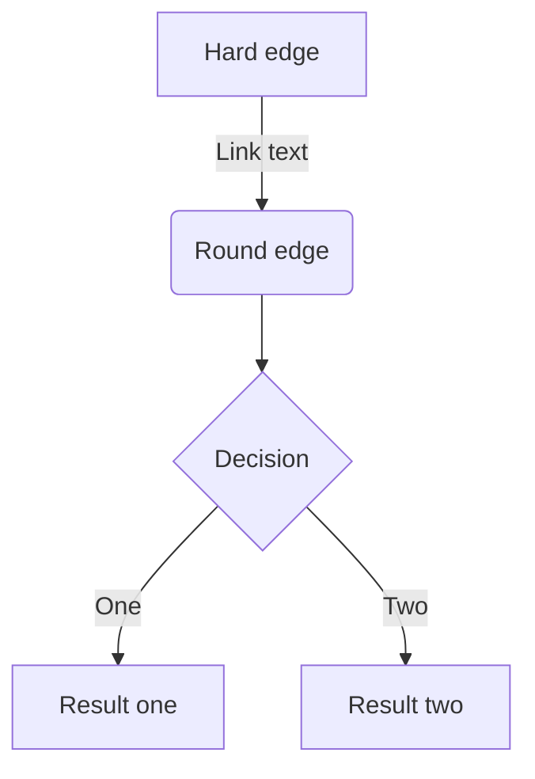
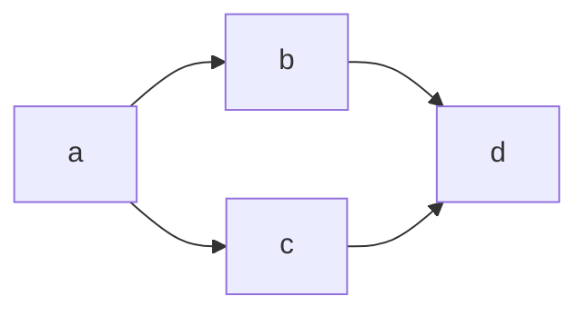

## Pthreadsについて

pthreadとは、POSIXスレッドのことで、POSIX標準のスレッドです。pthreadは、Unix系などで使われるそうです。C言語でスレッドプログラミングをするときに使用されるCライブラリです。プロセスを作成するforkとの違いは、スレッドは同じメモリ空間で殴打するため、プロセスのリソースが共有されることです。

## 排他制御

マルチスレッドプログラムをする際に、最も気を付けなければいけないことは、複数のスレッドで共有メモリ(ファイルディスクリプタを含め)を使用する際の排他制御動作です。オーバーヘッドを減らしながら、スレッドセーフな関数を作成する必要があります。

```cpp: primeNumber_thread.cpp
#include <pthread.h>
#include <stdio.h>
#include <stdlib.h>


#define MAX_PRIME_NUMBERS 100000

/* 素数の一覧表。nPrimeNumber個が小さい順番に入って行く */
int primeNumber[MAX_PRIME_NUMBERS];
int nPrimeNumber;
/* 素数かどうかを確認済みの最大の数 */
int primeNumberChecked;


/*
 *  mが素数かどうか確認する
 *  m/2以下の素数が全てprimeNumberテーブルに入っているものとする。
 */
int isPrimeNumber(int m) {
    int i;
    for(i = 0; i < nPrimeNumber; i++) {
        if(primeNumber[i] > m/2)
            return 1; /* m/2より大きい数で割り切れることはない */
        if(m%primeNumber[i] == 0)
            return 0;
    }
    return 1;
}

/*
 *  n以下の素数をprimeNumberテーブルに入れる。
 */
void generatePrimeNumbers(int n) {
    int i;

    if(n <= primeNumberChecked) {
        /* すでに素数一覧を作成済みなのでなにもすることはない */
        return;
    }
    /* 足りない分の素数表を作成する */
    for(i = primeNumberChecked+1; i <= n; i++) {
        if(isPrimeNumber(i)) {
            if(nPrimeNumber >= MAX_PRIME_NUMBERS) {
                printf("Oops, too many prime numbers.\n");
                exit(1);
            }
            primeNumber[nPrimeNumber] = i;
            nPrimeNumber++;
            //printf("%d: %d is a prime number\n", nPrimeNumber, i);
        }
    }
    primeNumberChecked = n;
    return;
}

/*
 * n以下の素数の個数を数える
 */
int countPrimeNumbers(int n) {
    int count,i;

    generatePrimeNumbers(n);
    count = 0;
    for(i = 0; i < nPrimeNumber; i++) {
        if(primeNumber[i] > n)
            break;
        count++;
    }
    return count;
}

void *threadFunc(void *arg) {
    int n = (int)arg;
    int x;

    x = countPrimeNumbers(n);
    printf("Number of prime numbers under %d is %d\n", n, x);

    return NULL;
}

int main() {
    int numberList[6] = {1,10,100,1000,10000,100000};
    pthread_t threads[6];
    int i;

    nPrimeNumber = 0;
    primeNumberChecked = 1;

    for(i = 0; i < 6; i++) {
        if(pthread_create(&threads[i], NULL, threadFunc, (void *)numberList[i]) != 0) {
            printf("Can't create thread (%d)\n", i);
            exit(1);
        }
    }

    for(i = 0; i < 6; i++) {
        pthread_join(threads[i], NULL);
    }

    printf("Done\n");

    return 0;
}

```

## 見出し3

- Hello!
- Hola!
  - Bonjour!
  - Hi!

1. First
2. Second

[アンカーテキスト](リンクのURL)


*サターンVロケットの一段目エンジン*

| Head | Head | Head |
| ---- | ---- | ---- |
| Text | Text | Text |
| Text | Text | Text |

```cpp:main.cpp
#include<iostream>
using namespace std;

int main(){
    cout << "Hello World!" << endl;
    return 0;
}
```

:::details 出力
Hello World!
:::

```diff cpp:diff.cpp
#include<iostream>
using namespace std;

int main(){
+   cout << "Hello World!!!" << endl;
-   cout << "Hello World!" << endl;
    return 0;
}
```

$$
e^{i\theta} = \cos\theta + i\sin\theta
$$

> 引用文
> 引用文

脚注の例[^1]です。インライン^[脚注の内容その2]で書くこともできます。

[^1]: 「Linuxとpthreadsによるマルチスレッドプログラミング入門」, 渋谷克智

-----

*イタリック*
**太字**
~~打ち消し線~~
インラインで`code`を挿入する

:::message
メッセージをここに
:::

:::message alert
警告メッセージをここに
:::

:::details タイトル
表示したい内容
:::

::::details タイトル
:::message
ネストされた要素
:::
::::


https://zenn.dev/zenn/articles/markdown-guide




